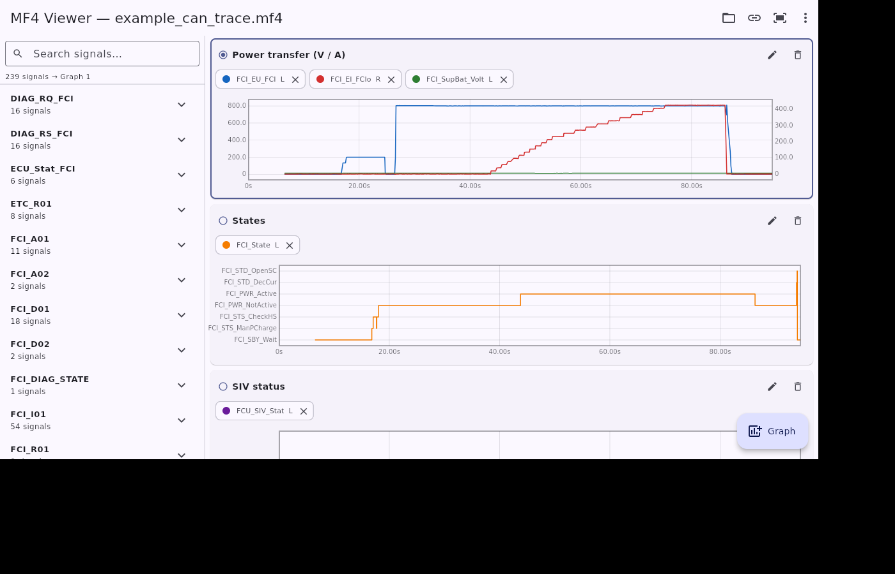

# MF4 Viewer &amp; Converter

A cross-platform tool for **ASAM MDF4 (`.mf4`) CAN trace logs** that both
**views** them and **converts other CAN log formats into `.mf4`**. Runs from a
single Flutter codebase on **Android, Windows and Linux**.



## Converting logs to MF4

Bring CAN logs from common tools into the self-describing MDF4 format:

- **Inputs:** Vector **BLF**, PEAK **TRC**, generic **CSV**, and existing
  **MDF/MF4** files.
- **Database (optional):** a **DBC** or AUTOSAR **ARXML** description. When
  supplied it is embedded in the output `.mf4` (ARXML is converted to DBC
  first), so the resulting trace can be decoded by this viewer and other
  DBC-based tooling.
- **Output:** a valid MDF 4.10 bus-logging file with the standard
  `CAN_DataFrame.*` channels.

The decode/convert engine is **pure Dart** (no Flutter dependency), so it is
unit-tested in isolation and reusable from a CLI.

### In the app

Tap the **convert** (⇄) action in the toolbar (or **Convert a log to MF4** on
the welcome screen), pick a log and an optional database, and save the `.mf4`.

### From the command line

```bash
dart run tool/convert.dart <input.{blf,trc,csv,mf4}> <output.mf4> \
    [--db <database.{dbc,arxml}>]

# e.g.
dart run tool/convert.dart drive.blf drive.mf4 --db vehicle.dbc
dart run tool/convert.dart capture.csv capture.mf4 --db ecu_extract.arxml
```

#### CSV input format

The CSV reader is header-driven and tolerant (delimiter `,`/`;`/tab is
auto-detected). Recognised columns (case-insensitive):

| Column                              | Meaning                                            |
| ----------------------------------- | -------------------------------------------------- |
| `Time` / `Timestamp` (`(ms)`/`(us)`)| time; a `ms`/`us` unit in the header rescales to s |
| `ID` / `Identifier` (`hex`)         | arbitration id (`0x…`, or `hex` header → base 16)  |
| `IDE` / `Extended`                  | extended-frame flag (else inferred from id width)  |
| `DLC` / `Length`                    | payload length (else the byte count)               |
| `Data` / `Data Bytes`               | hex payload, spaced (`11 22`) or contiguous        |
| `D0..D7` / `Byte0..` / `Data0..`    | one payload byte per column (alternative to `Data`)|

> ARXML support targets AUTOSAR 4.x system / ECU-extract descriptions; Motorola
> (big-endian) start-bit numbering is taken verbatim, so prefer Intel
> (little-endian) signals for exact decoding.

## Features

- **Reads `.mf4` CAN bus-logging files directly** — no conversion step.
  Handles the compact, real-world encoding produced by CAN loggers:
  - MDF 4.x block structure
  - `DZ` deflate **and transposed-deflate** data compression
  - `DL` / `HL` data lists
  - embedded, **zlib-compressed `.dbc`** attachments
- **Decodes signals on the fly** using the embedded DBC database
  (start bit / length / byte order / sign / factor / offset, including
  multiplexed signals).
- **Plots enumerations as text, not integers.** A signal such as `FCI_State`
  is drawn as a stepped line whose y-axis is labelled `FCI_SBY_Wait`,
  `FCI_PWR_Active`, … instead of `0, 1, 2`.
- **Multiple graphs**, added/removed freely, with a **linked time axis** so
  panning/zooming one graph moves them all (toggleable).
- **Independent left and right y-axes** per graph, so you can overlay e.g.
  voltage (left) and current (right).
- **Per-signal plot configuration**: axis side, colour, line width,
  stepped/linear, visibility — editable live from the legend chips.
- **Save / load plot configurations** as JSON.
- **Crosshair readout** showing each signal's value (enum text included) at
  the cursor time.
- **Efficient rendering**: a custom painter with binary-searched view
  windowing and per-pixel min/max decimation handles logs with tens of
  thousands of samples smoothly.

## Architecture

The decoding engine is **pure Dart** (no Flutter dependency) and is therefore
unit-testable in isolation:

```
lib/src/
  mdf/mdf4_reader.dart     MDF4 block parser, DZ (de)compression, CAN frame table
  dbc/dbc_model.dart       DBC data model (messages, signals, enum tables)
  dbc/dbc_parser.dart      Textual DBC parser (BO_ / SG_ / VAL_)
  dbc/dbc_writer.dart      DBC serializer (used to embed ARXML-sourced databases)
  convert/frame_builder.dart  Canonical CAN frame accumulator
  convert/readers/         BLF, TRC and CSV log readers
  convert/arxml_parser.dart   AUTOSAR ARXML -> DBC database
  convert/mf4_writer.dart  ASAM MDF 4.10 bus-logging writer
  convert/converter.dart   Format detection + log -> MF4 pipeline
  decode/can_decoder.dart  Bit extraction + physical/enum decoding -> SignalSeries
  decode/signal_series.dart
  model/plot_config.dart   Serializable workspace / graph / series config
  model/app_state.dart     App state, decode cache, time view (ChangeNotifier)
  chart/time_series_chart.dart   Dual-axis, enum-aware, decimating chart painter
  ui/                      Home page, signal picker, plot panel, converter page
```

The conversion path is `BLF/TRC/CSV/MDF reader → CanFrameTable → Mf4Writer`,
with an optional `DBC`/`ARXML` database embedded as an attachment.

The signal-decode path is `Mdf4Reader → CanFrameTable → CanDecoder + DbcDatabase
→ SignalSeries → ChartSeries`.

## Correctness / verification

The engine is verified end-to-end against
[`asammdf`](https://github.com/danielhrisca/asammdf) ground truth on the bundled
example trace (`test/fixtures/`). The test checks MDF version, frame count
(26 951 frames), DBC message count, sample counts, timestamps (to 1 µs) and both
numeric values (to 1e-4) and enum text for a set of signals:

```bash
flutter test
```

The converter has its own suite (`test/convert_test.dart`): the MF4 writer is
round-tripped back through the reader, each input reader (BLF — including a
zlib `LOG_CONTAINER`, TRC, CSV) is checked against fixtures, and the
ARXML → DBC path is validated.

A standalone CLI verifier is also provided:

```bash
dart run tool/verify.dart test/fixtures/example_can_trace.mf4 test/fixtures/ground_truth.json
```

## Running & building

Prerequisites: the [Flutter SDK](https://docs.flutter.dev/get-started/install)
(3.9+).

```bash
flutter pub get
flutter run                 # on the connected device / desktop
```

### Android

```bash
flutter build apk --release            # APK
flutter build appbundle --release      # Play Store bundle
```

Files are opened through the Android Storage Access Framework (the system file
picker), so no storage permission is required.

#### Download prebuilt binaries

A single GitHub Actions pipeline (`.github/workflows/release.yml`) runs
`flutter analyze` + `flutter test` and then builds every platform artifact (all
builds depend on the tests passing):

- **Every push / pull request** — downloadable from the run's **Summary** page
  under *Artifacts*:
  - `mf4_viewer-android` — the Android APK and Play Store bundle (`.aab`)
  - `mf4_viewer-windows` — a zipped Windows x64 build (the `.exe` plus its
    required DLLs and `data/` folder)
  - `mf4_viewer-linux` — a tarred Linux x64 bundle
- **Tagged releases** (push a tag like `v1.0.0`) — the APK, `.aab`, the Windows
  `.zip` and the Linux `.tar.gz` are also published on the repository
  **[Releases](../../releases)** page for one-click download.

> To run the Windows build, extract the `.zip` and launch `mf4_viewer.exe` —
> keep the accompanying DLLs and `data/` folder next to it.

> The Android release build is currently signed with Flutter's debug keys, so
> the APK is installable directly. Add a real signing config + secrets before
> distributing to end users or the Play Store.

### Windows

```bash
flutter build windows --release
```

### Linux

```bash
sudo apt install clang cmake ninja-build pkg-config libgtk-3-dev   # build deps
flutter build linux --release
```

### Auto-load (automation / demos)

The app can open a file at startup and pre-populate an example layout:

```bash
flutter run \
  --dart-define=MF4_AUTOLOAD=/abs/path/to/log.mf4 \
  --dart-define=MF4_DEMO=1
```

## Usage

1. Tap **Open MF4 file** and choose a `.mf4` CAN trace.
2. Tap a graph's header to make it the *target*, then pick signals from the
   left panel (search by name or message).
3. Tap a legend chip to configure a signal (axis, colour, stepped, width).
4. Use the **+ Graph** button for more graphs; pan/zoom by dragging /
   pinching, double-tap to reset, and use the toolbar to link the time axis or
   export the configuration.

## Notes & limitations

- The viewer targets **CAN/CAN-FD bus-logging** MF4 files with an embedded (or
  selectable) DBC. Files that already store decoded channels with their own
  conversions are a natural extension but are not the primary path today.
- A signal is shown on a **categorical (text) axis only when it is a pure
  enumeration** (no scaling). A signal that has a real factor/offset *and* a
  sparse value table (e.g. a frequency in Hz reserving an `SNA` code) is plotted
  numerically; its enum text still appears in the crosshair readout.
